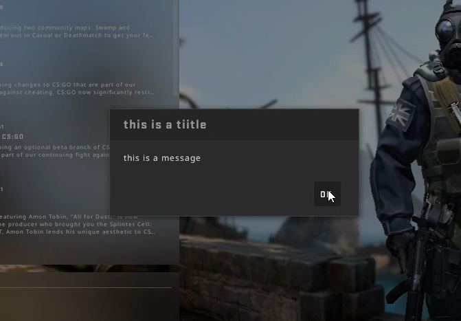

# CSGO External Message Boxes / ShowMessageDialog
A PoC about calling the ShowMessageDialog function in GameUI011 of CS:GO from an external program.

[Demo Video](https://files.catbox.moe/bk85ny.mp4)  
Inspired by [this post](https://www.unknowncheats.me/forum/counterstrike-global-offensive/251531-game-messagebox-csgo.html) from UC

[UC Thread](https://www.unknowncheats.me/forum/counterstrike-global-offensive/415097-external-ingame-message-boxes.html)

# Usage
CSGOExternalMessageBox.exe **< message >** **< title >**